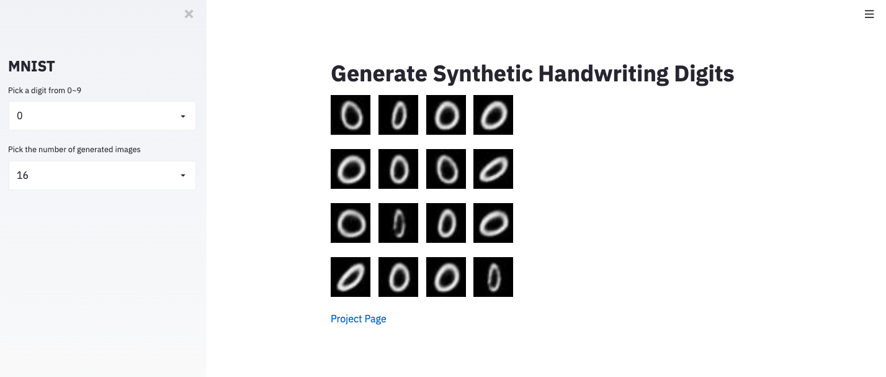
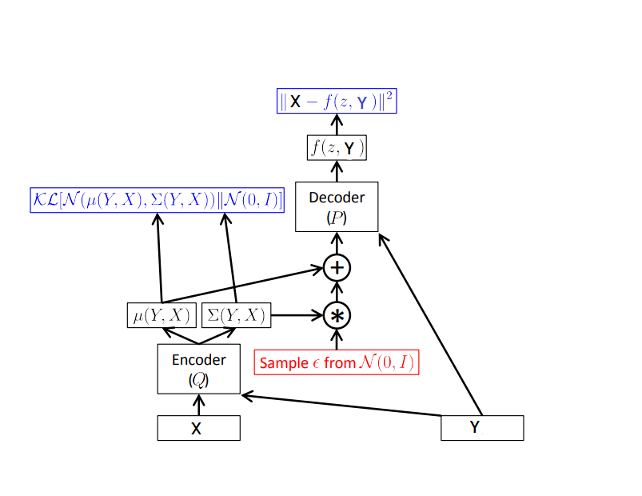
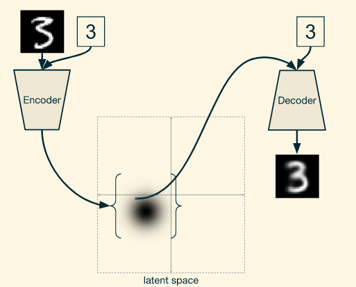

# Oversampling with the Conditional Variational Autoencoder (CVAE)

A demo [web app](https://demo-cvae-app.herokuapp.com/) has been deployed in Heroku.


Oversampling such as SMOTE is very popular in addressing imbalanced data classification.
However, feature space distance-based learning algorithms such as
SMOTE seem to fail to capture the true joint distribution
of features and labels. While generative models such as
Variational Autoencoders (VAE) are able to learn the underlying
joint distribution. Inspired by the previous [work](https://arxiv.org/abs/1406.5298),
our team proposed a new generative method, namely the [VoS](https://arxiv.org/abs/1809.02596):
a Method for **V**ariational **O**ver**S**ampling of Imbalanced Data.
Note that we have made material changes since we published it in arXiv and the new paper is under review currently.

## Major difference between VAE and CVAE
In CVAE, we inject the label information **both** in encoding phase and decoding phase. Once the model is trained, we can sample from the latent space z ~ Q(z|X,y), usually following a Gaussian distribution, to generate synthetic data. In our paper we showed that empirically the CVAE outperformed other generative models such as SMOTE, CGAN, ACGAN etc. when oversampling the minority class examples in imbalanced data.



## How to run this demo locally
Firstly clone this project into your local
```bash
$ git clone git@github.com:HongleiXie/demo-CVAE.git
$ cd demo-CVAE
```
Next, run the following commands to set up the enviroment
```bash
$ conda env create -f environment.yml # or environment-windows.yml on Windows
$ conda activate demo
```
Next let's train the model locally (make sure you are under the `demo` env)
```bash
$ python train.py --batch_size 32 --EPOCHS 10 --latent_dim 2 --inter_dim 128
```
Make sure you are able to see the checkpoint being saved in `~/saved_model/` folder.
You may also check out the log files under `~/logs/`.

Now you are able to launch the app by
```bash
$ streamlit run app.py
```
Following the URL shown in your terminal.
Done!
